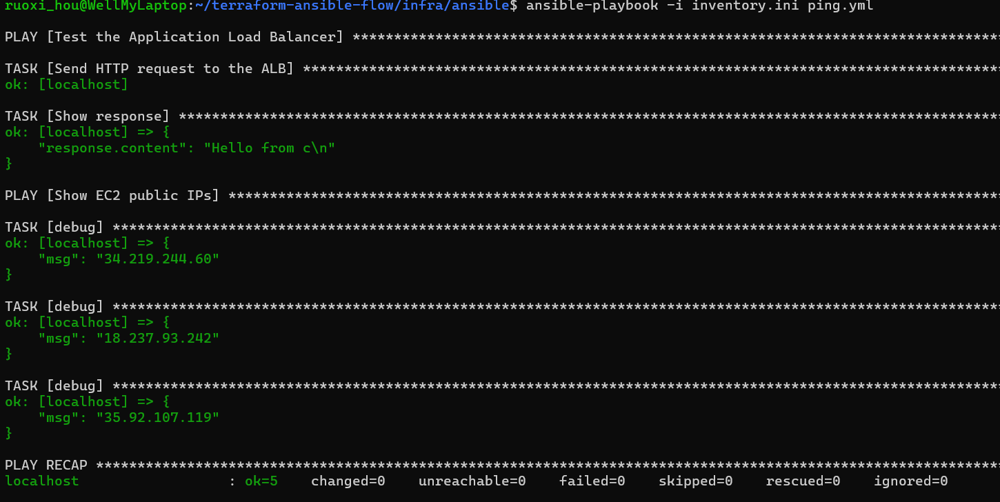

This is a project where you can create a terraform infrastructure with 3 instances
(including `.pem` keys), and then run ansible to automatically configure them.

There is still no ansible playbooks in them, but you can execute ansible adhoc commands:

```bash
ansible -m ping all
````

# Getting Started

You go to infra folder, then you run:
```bash
terraform init
terraform plan
terraform apply
```

This will generate the infra and the private keys to connect.
Right now, terraform isn't automating the creation of keys in ansible's folder.
You have to **manually copy the generate key in infra folder to ansible's folder (in keys folder)**.

Make sure to also update the **`/ansible/group_vars/all.yaml`** with the new public IP's from your machines.

After that, go to ansible's folder, and execute:
```bash
ansible -m ping 
```

And boom, you're done!

Feel like an extra?
Make a PR to this very same repo, enabling:
- Auto-save of new keys in ansible's folder
- Auto-save of new IP's in ansible's variable file.


Things added:
- A load balancer
- Output from Terraform automatically saved under all.yml and inventory.ini