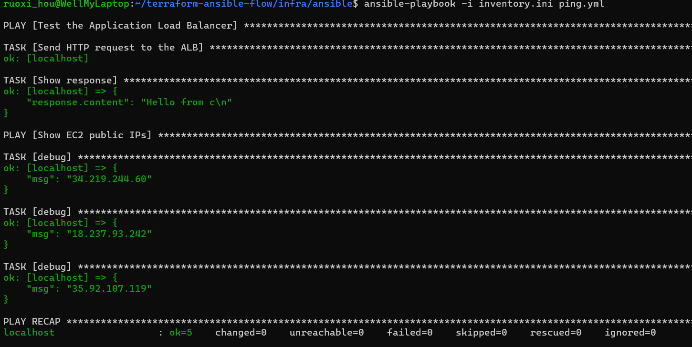

# Terraform + Ansible flow

Terraform creates the infrastructure in AWS (`us-east-1`), then Ansible configures the machines.

> Want the version with an Application Load Balancer in front of the instances? Check out the `load-balancer` branch.

## What gets created

- A new VPC with 3 public subnets (one per AZ: `us-east-1a`, `b`, `c`) + internet gateway + route table
- 3 EC2 instances (`a`, `b`, `c`), one in each subnet, open on ports 22 (SSH) and 80 (HTTP)
- An SSH key pair. The private key is saved straight into `ansible/<student_name>-ssh-key.pem`

Terraform also generates `ansible/inventory.ini` with the 3 hosts, their public IPs and the SSH key,
so you don't have to copy anything by hand.

## Folder structure

```
infra/     -> Terraform code (run terraform here)
ansible/   -> Ansible config, playbook and template (run ansible here)
  host_vars/a.yml, b.yml, c.yml  -> per-machine variables (the "username" shown on each page)
  templates/index.html.j2        -> Jinja template for the web page
```

## Getting started

Requirements: Terraform, Ansible and AWS credentials configured (`aws sts get-caller-identity` should work).

### 1. Create the infrastructure

```bash
cd infra
terraform init
terraform apply -var student_name=yourname
```

Use your own `student_name` (lowercase, short, no spaces). It's used to name the AWS resources, so it must be unique in the shared account.

When it finishes, Terraform prints the public IP of each instance.

### 2. Configure the machines with Ansible

Wait about a minute for the instances to boot, then:

```bash
cd ../ansible
ansible all -m ping          # check that Ansible can reach the 3 machines
ansible-playbook playbook.yml  # install Nginx and deploy a custom index.html on each one
```

### 3. Check the result

Open `http://<public_ip>` for each instance (or use `curl`). Each machine shows its own page,
built from the `username` in its `host_vars` file ("Hello from Alberta / Bocahontas / Cocoon").

### 4. Clean up

```bash
cd ../infra
terraform destroy -var student_name=yourname
```


